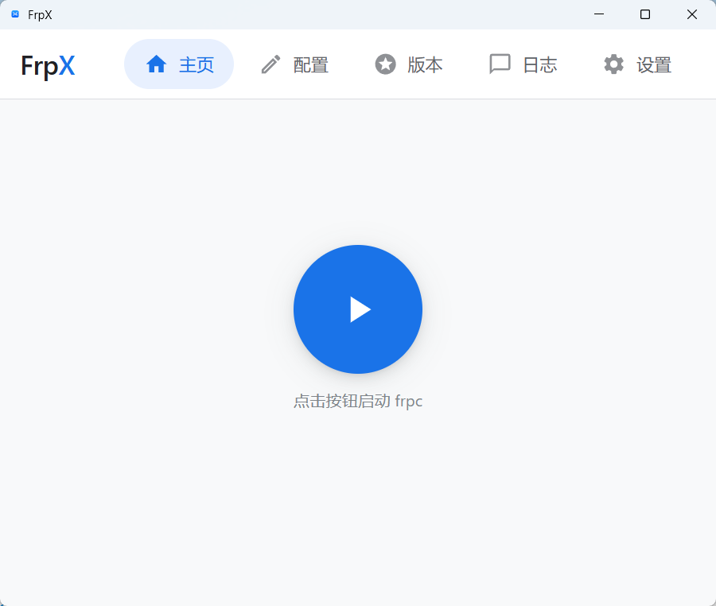
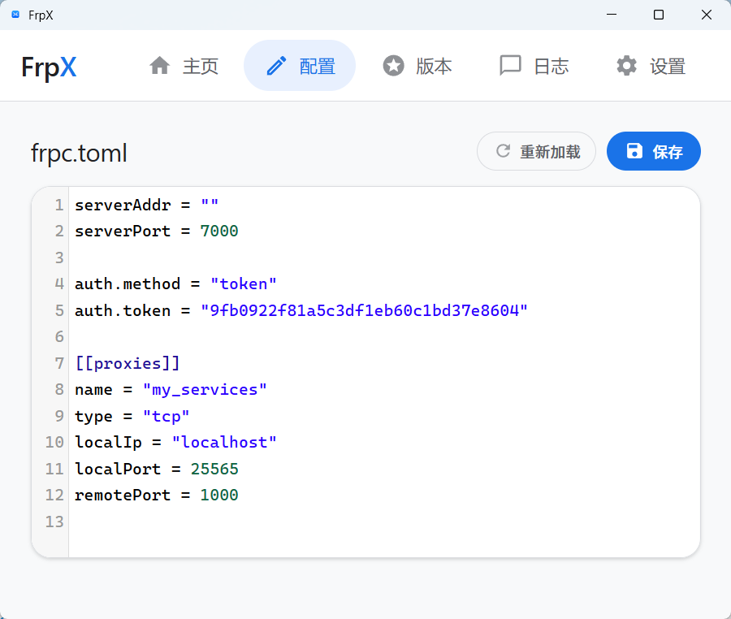
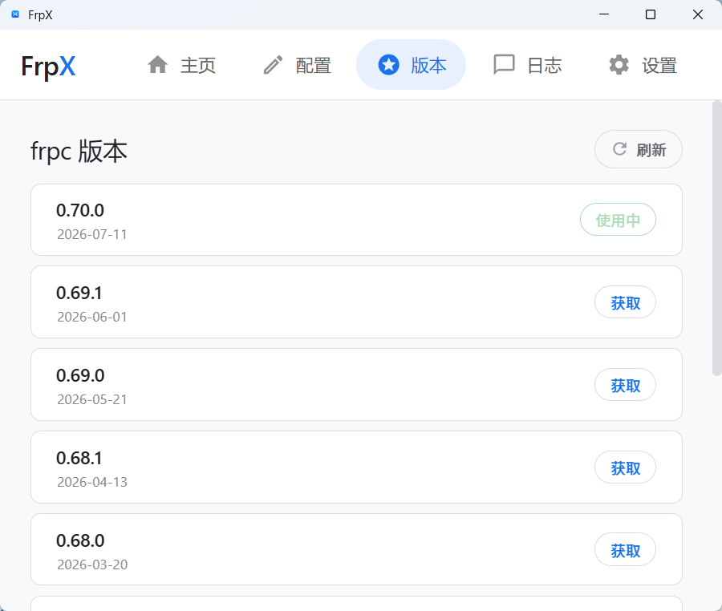
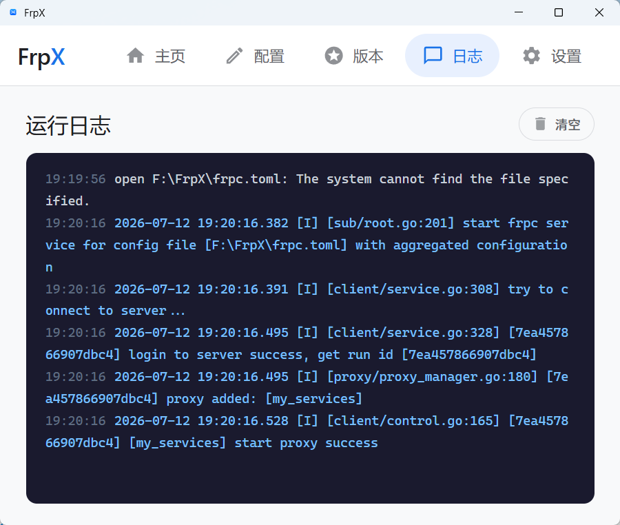
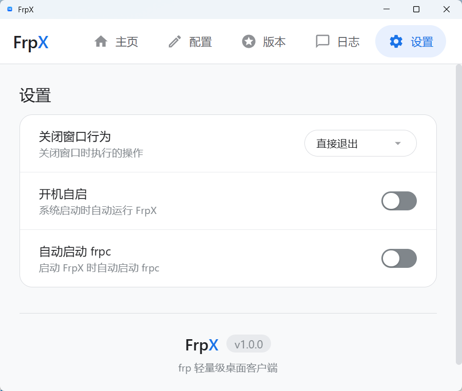

# FrpX

> 🚀 frp 轻量级桌面客户端 ，告别命令行

[](https://go.dev/)
[](LICENSE)
[](https://www.microsoft.com/windows)

---

## ✨ 特性

- 🎯 **一键启停** — 启动/停止 frpc 内网穿透
- 📝 **配置编辑** — 内置 TOML 编辑器，语法高亮 + 格式校验
- 🔄 **版本管理** — 自动获取 GitHub 最新 frpc 版本，一键下载
- 📊 **实时日志** — 查看 frpc 运行日志，支持着色显示
- 🌐 **代理支持** — 自动检测系统代理，国内外通用
- 🔧 **开机自启** — 支持 Windows 注册表自启动

---

## 📦 安装

### 下载

前往 [Releases](https://github.com/yourname/FrpX/releases) 下载最新版，解压后双击 `FrpX.exe` 启动。

### 从源码编译

```bash
git clone https://github.com/yourname/FrpX.git && cd FrpX
export CGO_ENABLED=1
go build -ldflags "-s -w -H windowsgui" -o FrpX.exe .
```

---

## 🚀 快速开始

1. 双击 `FrpX.exe` 启动
2. 进入「版本」页面，下载最新版 frpc
3. 进入「配置」页面，填写 frp 服务器信息
4. 返回「主页」，点击启动按钮

---

## 📸 界面预览

<table>
<tr>
<td align="center"><b>主页</b></td>
<td align="center"><b>配置编辑器</b></td>
<td align="center"><b>版本管理</b></td>
</tr>
<tr>
<td></td>
<td></td>
<td></td>
</tr>
<tr>
<td align="center"><b>日志查看</b></td>
<td align="center"><b>设置</b></td>
<td></td>
</tr>
<tr>
<td></td>
<td></td>
<td></td>
</tr>
</table>

---

## ⚙️ 配置

FrpX 使用标准的 frpc.toml 配置文件。内置编辑器支持语法高亮和格式校验。

**配置校验：**

- 保存时自动校验格式
- 错误提示包含行号（如 `7:缺少]]`）
- 支持嵌套键名（如 `auth.method`）

---

## 🏗️ 架构

**FrpX = Go 后端 + WebView2 前端 + frpc 子进程**

| 组件              | 职责                            |
| --------------- | ----------------------------- |
| **Go Backend**  | HTTP API、进程管理、GitHub 客户端、代理检测 |
| **WebView2 UI** | 主页、配置编辑器、版本管理、日志、设置           |
| **frpc.exe**    | 内网穿透服务（子进程，自动管理）              |

### API 端点

| 端点                    | 方法         | 说明               |
| --------------------- | ---------- | ---------------- |
| `/api/status`         | GET        | 获取 frpc 运行状态     |
| `/api/start`          | POST       | 启动 frpc（自动清理旧进程） |
| `/api/stop`           | POST       | 停止 frpc（强制终止）    |
| `/api/config`         | GET/POST   | 读写 frpc.toml     |
| `/api/versions`       | GET        | 从 GitHub 获取版本列表  |
| `/api/download`       | POST       | 下载指定版本 frpc      |
| `/api/uninstall`      | POST       | 删除 frpc.exe      |
| `/api/has_frpc`       | GET        | 检查 frpc.exe 是否存在 |
| `/api/logs`           | GET/DELETE | 获取/清空 frpc 运行日志  |
| `/api/settings`       | GET/POST   | 应用设置             |
| `/api/apply_settings` | POST       | 应用设置（注册表）        |

---

## 🔧 开发

**环境要求：** Go 1.21+、GCC (MSYS2)、WebView2 Runtime

```bash
# 编译
export CGO_ENABLED=1
go build -ldflags "-s -w -H windowsgui" -o FrpX.exe .

# 或使用 build.bat（Windows）
.\build.bat
```

详见 [CLAUDE.md](CLAUDE.md) 了解项目架构。

---

## 🐛 常见问题

| 问题               | 解决方案                                  |
| ---------------- | ------------------------------------- |
| frpc.exe 被杀毒软件拦截 | 将 `frpc.exe` 添加到 Windows Defender 排除项 |
| 无法连接 GitHub      | FrpX 自动检测系统代理，或设置 `HTTP_PROXY` 环境变量   |
| 版本获取失败           | 检查网络连接，确认代理设置正确                       |

---

## 🤝 贡献

欢迎提交 Issue 和 Pull Request！详见 [CONTRIBUTING.md](CONTRIBUTING.md)。

## 📄 许可证

[MIT License](LICENSE)

## 🙏 致谢

- [frp](https://github.com/fatedier/frp) — 高性能反向代理
- [webview](https://github.com/webview/webview) — 跨平台 WebView
- [CodeMirror](https://codemirror.net/) — 代码编辑器

---

<p align="center">如果觉得有用，请给个 ⭐ Star 支持一下！</p>
