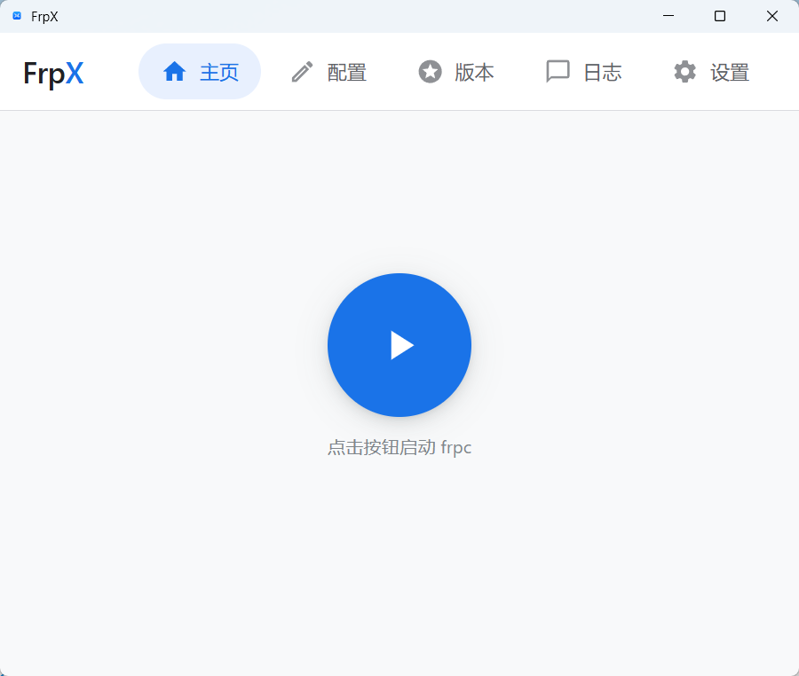
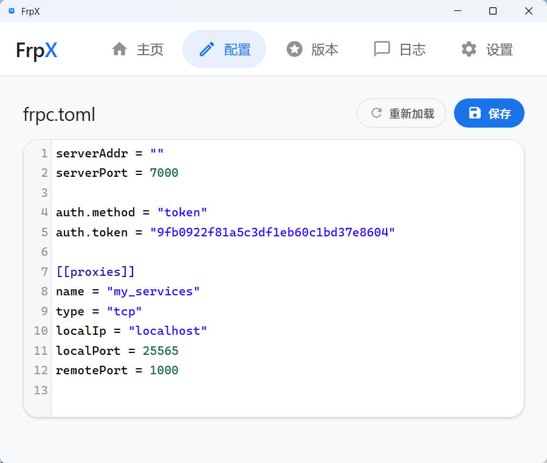
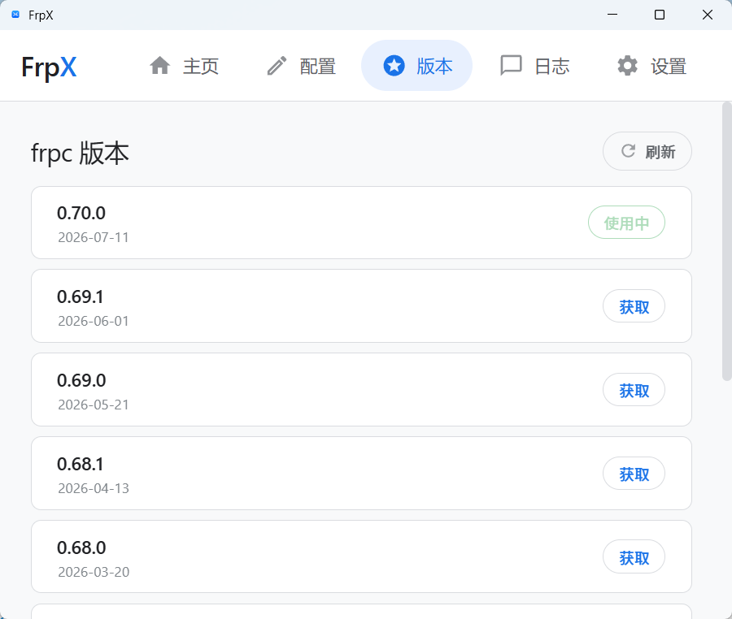
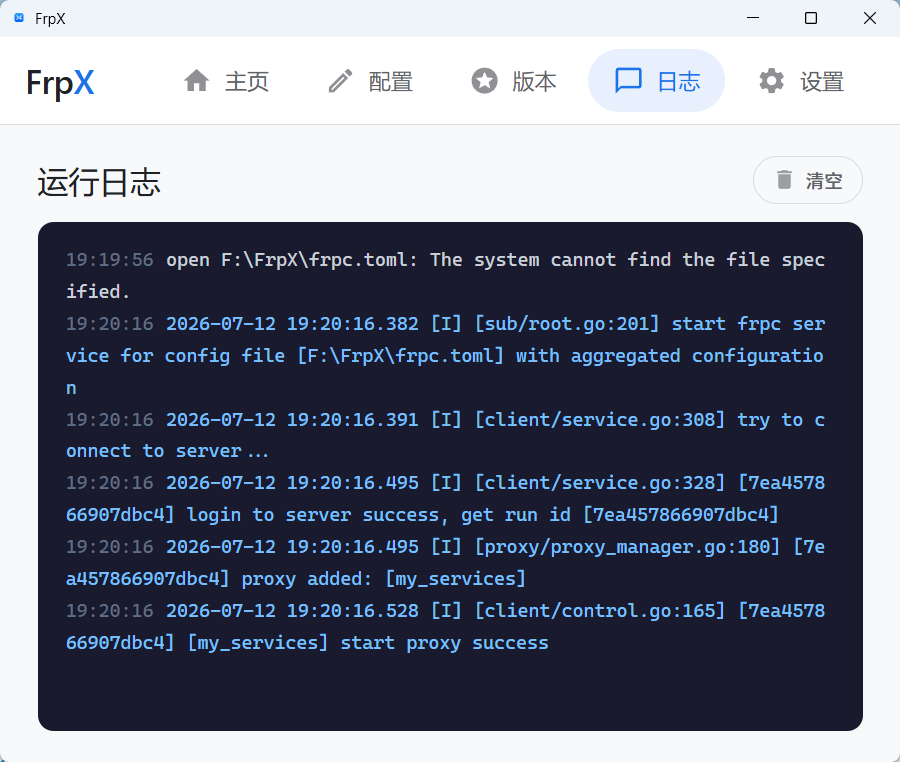
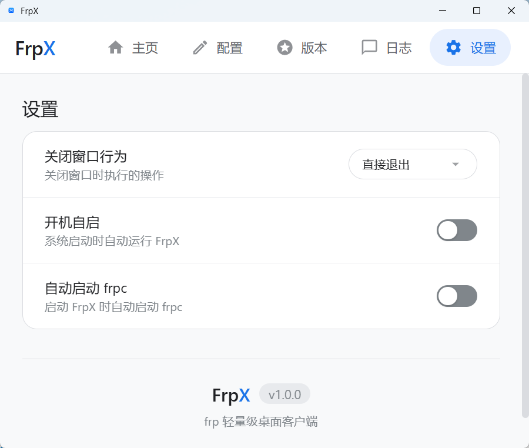

<div align="center">

# FrpX

**frp 轻量级桌面客户端 —— 下载、配置、启动、日志，一个窗口全搞定，不用再敲命令行。**

[](https://go.dev/)
[](https://wails.io)
[](LICENSE)
[](https://www.microsoft.com/windows)

**[下载安装](#-下载安装) · [快速开始](#-快速开始) · [特性](#-特性) · [常见问题](#-常见问题) · [从源码构建](#️-从源码构建)**

</div>

---

## 💡 为什么做 FrpX？

每次用命令行启动 frpc 都觉得麻烦——就算写了启动脚本，改配置还是得重启，来回折腾。

也试过其他 frpc 客户端，都差点意思：很多项目把 TOML 配置拆成一堆表单，打开一看头都大了。这么多表单……还不如直接写 TOML 文件。

于是把下载、配置、启动、日志全部揉在一起，做成了 FrpX：单文件、免安装，U 盘拷走即用。

---

## ✨ 特性

- **一键启停** — 主页大按钮控制 frpc，附带运行状态显示
- **直接写 TOML** — 内置编辑器，语法高亮，不用在几十个表单项里找字段
- **版本管理** — 自动从 GitHub 获取 frpc 版本列表，一键下载指定版本（自动识别系统代理，国内外通用）
- **实时日志** — frpc 输出实时滚动，500 行环形缓冲，ANSI 颜色码已过滤
- **开机自启** — 可选 Windows 注册表自启动、启动后自动拉起 frpc
- **单文件便携** — `FrpX.exe` 约 12MB，所有运行时文件都在同目录 `data/` 下

---

## 📸 界面预览

| 主页                                  | 配置                                  | 版本                                  |
|:-----------------------------------:|:-----------------------------------:|:-----------------------------------:|
|  |  |  |

| 日志                                  | 设置                                  |
|:-----------------------------------:|:-----------------------------------:|
|  |  |

---

## 📥 下载安装

### 环境要求

- Windows 10 / 11（需系统自带 WebView2）
- 无需安装 Go / Node 等任何开发环境

### 步骤

1. 到发行版页面下载 `FrpX.exe`，放到任意目录（U 盘也行）
2. 双击运行，首次启动会自动生成 `data/` 目录和默认配置
3. 进「版本」页下载一个 frpc，进「配置」页填服务器信息，回主页点启动

### 运行时文件说明

| 路径                        | 说明                       |
| ------------------------- | ------------------------ |
| `data/frpc.exe`           | 下载的 frpc 二进制（多版本切换时会被替换） |
| `data/frpc.toml`          | 你的客户端配置，缺失时自动生成默认模板      |
| `data/frpx_settings.json` | 软件设置（关闭行为、自启等）           |
| `data/frpc.version`       | 记录当前 frpc 版本号            |

---

## 🚀 快速开始

一个最小可用配置示例（在「配置」页直接粘贴修改）：

```toml
serverAddr = "x.x.x.x"   # 换成你的 frps 服务器 IP
serverPort = 7000

auth.method = "token"
auth.token = "换成你的 token"

[[proxies]]
name = "ssh"
type = "tcp"
localIP = "127.0.0.1"
localPort = 22
remotePort = 6000
```

保存后回主页点启动，去「日志」页确认出现 `start proxy success` 即表示穿透成功。

---

## 🆚 和其他客户端的区别

|           | FrpX              | 表单式客户端    |
| --------- | ----------------- | --------- |
| 配置方式      | 直接编辑 TOML         | 每个字段一个表单项 |
| 新增 frp 特性 | 立刻可用（写进 TOML 就行）  | 等作者加表单    |
| 体积        | 单文件约 12MB         | 安装包通常更大   |
| 适用人群      | 看得懂 TOML，想怎么配就怎么配 | 完全不想碰配置文件 |

一句话：如果你觉得"表单还不如直接写文件"，FrpX 就是给你做的。

---

## ❓ 常见问题

<details>
<summary><strong>frpc.exe 被杀毒软件拦截 / upanish</strong></summary>

frp 是反向代理工具，部分杀软会误报。将 FrpX 所在目录加入 Windows Defender 排除项即可。

</details>

<details>
<summary><strong>任务栏 / 资源管理器图标没变，还是旧的</strong></summary>

Windows 按路径缓存图标。执行 `ie4uinit -ClearIconCache` 刷新，或取消固定后重新固定，仍不行再重启 explorer。

</details>

<details>
<summary><strong>「版本」页获取失败</strong></summary>

先检查网络和代理。FrpX 会按「环境变量 → 注册表系统代理 → 直连」的顺序尝试 GitHub，代理和直连都失败才会报错。

</details>

<details>
<summary><strong>编译报错</strong></summary>

必须用 `wails build`（需要 `desktop,production` 等构建标签），不能直接 `go build`。且 `CGO_ENABLED=1` 必需，Wails 依赖 CGO。

</details>

---

## 🛠️ 从源码构建

### 前置依赖

- Go 1.21+
- GCC（MSYS2 mingw64）
- Node.js
- 系统 WebView2

### 编译

```bash
# 一键构建（推荐）
build.bat

# 或手动执行
set CGO_ENABLED=1
wails build -ldflags "-s -w -H windowsgui"
```

产物在 `build/bin/FrpX.exe`。开发调试用 `wails dev`（热重载）。

---

## 🏗️ 架构

```
FrpX.exe（Go + Wails v2 + WebView2）
├── Go 后端：Wails 绑定 / frpc 子进程管理 / GitHub API 客户端（含代理）
└── 前端：原生 JS + Material Design + CodeMirror，go:embed 打进 exe
```

前端通过 `window.go.main.App.MethodName()` 直接调用 Go 方法，无需 HTTP 服务。详细说明见 [CLAUDE.md](CLAUDE.md)。

---

## 🤝 贡献

欢迎提交 Issue 和 Pull Request！加新功能前建议先开 Issue 讨论下方案。

## 📄 许可证

[MIT License](LICENSE)

## 🙏 致谢

- [frp](https://github.com/fatedier/frp) — 高性能反向代理
- [Wails](https://wails.io) — Go + WebView2 桌面框架
- [CodeMirror](https://codemirror.net/) — 代码编辑器

---

<p align="center">如果觉得有用，请给个 ⭐ Star 支持一下！</p>
